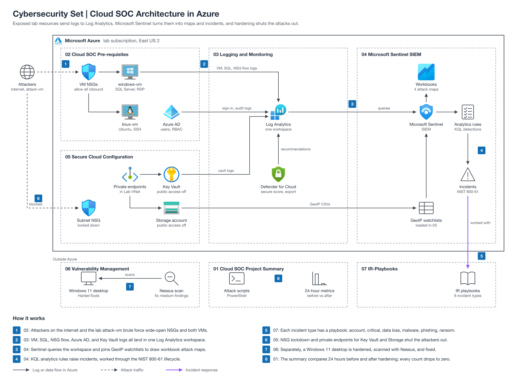

# Cybersecurity Set

Follow-along cybersecurity projects: build and harden a cloud SOC and honeynet in Azure with Microsoft Sentinel, harden and scan a Windows 11 desktop, and work from a library of incident response playbooks.

The diagram shows how the sections fit together: attackers hit the exposed Azure lab, logs flow into Log Analytics and Microsoft Sentinel, incidents are worked with the IR playbooks, and hardening shuts the attacks out, with each box labeled by its folder number.

| Section | What you'll build | Folder |
| --- | --- | --- |
| Summary of Cloud SOC Project | Series overview, shared Sentinel files and attack scripts, and the before and after hardening metrics | [01-cloud-soc-project-summary](01-cloud-soc-project-summary/) |
| Cloud SOC Pre-requisites | Azure VMs, network, SQL, failed logins, and access control for the lab | [02-cloud-soc-prerequisites](02-cloud-soc-prerequisites/) |
| Logging and Monitoring | Tenant, subscription, and resource logs flowing into Log Analytics, plus GeoIP watchlists | [03-logging-and-monitoring](03-logging-and-monitoring/) |
| Microsoft Sentinel SIEM | Attack-map workbooks, analytics rules, simulated attacks, and incident handling | [04-microsoft-sentinel-siem](04-microsoft-sentinel-siem/) |
| Secure Cloud Configuration | NSG lockdown, private endpoints, and firewalls, then a second 24-hour measurement | [05-secure-cloud-configuration](05-secure-cloud-configuration/) |
| Vulnerability Management | A hardened Windows 11 desktop, scanned with Nessus, with the medium findings fixed | [06-vulnerability-management](06-vulnerability-management/) |
| IR-Playbooks | NIST SP 800-61 based incident response playbooks, workflows, and templates | [07-ir-playbooks](07-ir-playbooks/) |

## How to use

Start with [Summary of Cloud SOC Project](01-cloud-soc-project-summary/) for the big picture, then work sections 02 to 05 in order, since each Cloud SOC lab builds on the previous one. Sections 06 and 07 stand on their own. Each folder's README is a step-by-step guide with expected results, and each folder keeps the commit history of the repo it came from.

## License

Code and scripts in this repository are licensed under the MIT License (see [LICENSE](LICENSE)). Written guides and diagrams are licensed under [CC BY 4.0](https://creativecommons.org/licenses/by/4.0/). Third-party material keeps its original license and is excluded from both:

- `07-ir-playbooks/` is adapted from a third-party IR playbook template; it keeps its existing attribution and the original template's license.
- `01-cloud-soc-project-summary/Top 300 Azure Sentinel Used Cases KQL (Kusto Query Language).pdf` is a third-party reference document.
